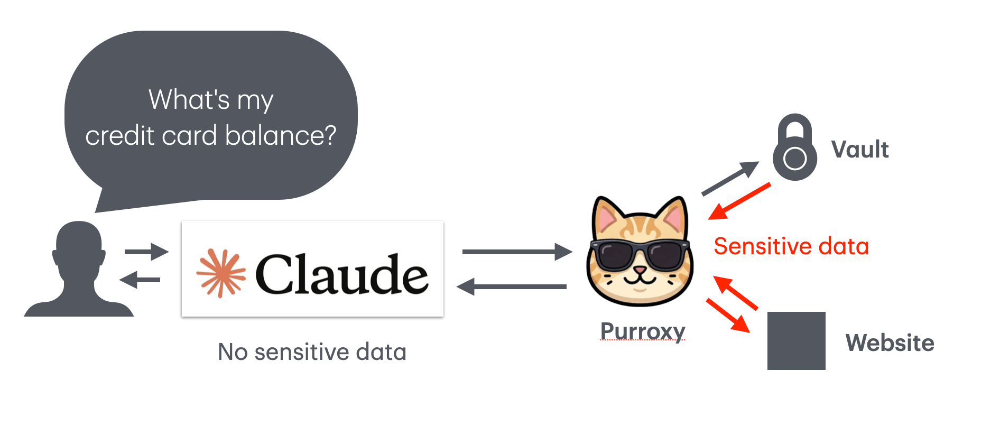

# Purroxy

[](https://github.com/mreider/purroxy/actions/workflows/build.yml)
[](https://github.com/mreider/purroxy/releases)
[](LICENSE)
[](#verifying-builds)
[](#verifying-builds)
[](https://docs.purroxy.com)

Purroxy gives Claude secure access to websites that require your login. You log in once through a secure embedded browser. Purroxy saves the session (encrypted on your machine) and turns it into capabilities that Claude can use on your behalf. Your credentials never leave your computer and are never sent to any AI.

## The problem

AI assistants like Claude can browse the web, call APIs, and write code. But they cannot log into your email, check your bank balance, pay a bill, or renew a domain. Anything behind a login wall is off limits.

The usual workaround is to give your credentials to a third-party automation service that stores them on their servers and makes requests on your behalf. This works, but your sensitive data passes through someone else's infrastructure.

## How Purroxy solves it

Purroxy runs locally on your machine as a Claude Desktop connector. When you want Claude to do something on a website that requires your login:

1. **You log in yourself** through a secure embedded browser in the Purroxy desktop app. Purroxy saves the session cookies, encrypted with your OS keychain. It never sees your password.

2. **You build a capability** by telling Purroxy what you want to do on the site. Purroxy's AI agent navigates the site, learns its structure, and saves a reusable capability (like "check my email" or "pay my electric bill").

3. **Claude uses the capability** through the MCP protocol. Purroxy loads the page with your saved session, reads the content, and extracts the data Claude asked for. Claude sees the business result ("you have 3 unread emails") but never sees your credentials, cookies, or any sensitive data from your vault.

## Security model

Purroxy's security is architectural, not policy-based.

**Credentials**: You log in through the real website in an embedded browser. Purroxy captures session cookies but never your username or password. Cookies are encrypted with your OS keychain (macOS Keychain, Windows DPAPI, Linux libsecret).

**Vault**: Sensitive values like credit card numbers or account IDs are stored in an encrypted vault. During automation, Purroxy types them directly into browser forms via Playwright. Before the page content is sent to Claude for data extraction, all vault values are scrubbed and replaced with `[REDACTED:key_name]`. This is not a prompt-level guardrail. The value is literally absent from the API call.

**Auto-lock**: After configurable inactivity, Purroxy locks and requires a PIN to unlock. Claude cannot access any capabilities while Purroxy is locked.

**No cloud dependency**: Purroxy processes run locally. Claude API calls go directly from your machine to Anthropic. No Purroxy servers process your data.

Full security documentation: [purroxy.com/docs/security](https://purroxy.com/docs/security)

## Building from source

```bash
git clone https://github.com/mreider/purroxy.git
cd no-api-no-problem
npm install
npm run build
npm run start
```

The web app (purroxy.com) is in the `web/` directory:

```bash
cd web
npm install
npm run dev
```

## Verifying builds

Every release includes SHA-256 checksums and SLSA provenance attestation so you can verify that the binary you download was built from the source code in this repository.

**Check the checksum:**

```bash
# Download the checksum file from the release
shasum -a 256 -c checksums.txt
```

**Verify the git tag:**

```bash
git verify-tag v0.2.0
```

**Verify SLSA provenance (if available):**

```bash
gh attestation verify Purroxy-*.dmg --repo mreider/purroxy
```

**Reproducible build**: Clone this repo at the release tag, run `npm ci && npm run build && npx electron-builder`, and compare the output hash against the published checksum.

## Architecture



Sensitive data (credentials, vault values, session cookies) flows only between Purroxy, the encrypted vault, and the target website. Claude receives only tool calls and scrubbed results. No sensitive data ever reaches the AI.

- **MCP Server**: Discovers all sites from disk, registers capabilities as tools
- **Proxy**: Runs inside the Electron app, handles authentication and execution
- **Playwright**: Loads pages with saved session cookies, types vault values
- **Claude API**: Called locally to extract data from scrubbed page content

## Contributing

Sites (pre-built capabilities for specific websites) can be submitted to the public library via pull request to [mreider/purroxy-sites](https://github.com/mreider/purroxy-sites). Approved contributors get free access to Purroxy.

## License

Apache License 2.0. See [LICENSE](LICENSE).
